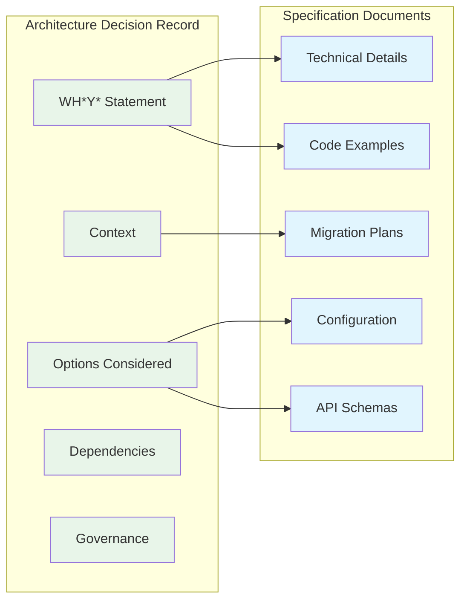

# SPEC-ADR-B: ADR Minimalism and Separation

| Field | Value |
|-------|-------|
| **Specification ID** | SPEC-ADR-B |
| **Parent ADR** | [ADR-REF-001](ADR-FORMAT.md) |
| **Version** | 1.0 |
| **Status** | Draft |
| **Last Updated** | 2026-01-08 |

---

## Overview

This specification defines the principle of ADR minimalism and the separation of architectural decisions from detailed specifications. ADRs should capture the **decision** and its **rationale**, not the implementation details.

---

## Core Principle

> **An ADR should be readable in under 5 minutes and answer one question: "Why did we make this decision?"**

Everything else -- implementation details, configuration examples, API schemas, migration scripts -- belongs in separate specification documents that the ADR references.

---

## Separation of Concerns



---

## Content Boundaries

### What Belongs in an ADR

| Content Type | Example | Why It Belongs |
|-------------|---------|----------------|
| WH(Y) statement | 6-part decision statement | Core decision rationale |
| Context narrative | Business drivers, constraints | Explains the "why" |
| Options considered | 2-4 alternatives with pros/cons | Shows due diligence |
| Dependencies | Links to related ADRs | Tracks decision relationships |
| Governance metadata | Review dates, approvers | Ensures accountability |
| Status history | Proposed -> Accepted timeline | Tracks decision lifecycle |

### What Does NOT Belong in an ADR

| Content Type | Example | Where It Goes |
|-------------|---------|---------------|
| Code samples | Implementation snippets | Specification document |
| Configuration | YAML/JSON/TOML config blocks | Specification document |
| API schemas | OpenAPI, GraphQL schemas | Specification document |
| Database schemas | SQL DDL, migration scripts | Specification document |
| Sequence diagrams | Detailed interaction flows | Specification document |
| Performance benchmarks | Load test results | Specification document |
| Deployment procedures | Runbooks, scripts | Specification document or operational docs |

---

## Stability Comparison

ADRs and specifications have fundamentally different change characteristics:

| Characteristic | ADR | Specification |
|---------------|-----|---------------|
| **Change frequency** | Rare (ideally never after acceptance) | Frequent (evolves with implementation) |
| **Versioning** | Status transitions only | Semantic versioning (1.0, 1.1, 2.0) |
| **Audience** | Decision makers, future architects | Implementers, developers |
| **Review trigger** | Governance cadence or superseding decision | Implementation changes |
| **Size** | 1-3 pages | Varies (can be extensive) |

This difference is why separation matters: a decision record that changes with every implementation update loses its value as a historical record.

---

## Reference Pattern

ADRs reference specifications through a standardized table:

```markdown
## Specifications

| Spec ID | Title | Description |
|---------|-------|-------------|
| [SPEC-XXX-A](path/to/spec-a.md) | Title A | Brief description |
| [SPEC-XXX-B](path/to/spec-b.md) | Title B | Brief description |
```

### Naming Convention

- **Spec ID format:** `SPEC-[ADR-ID]-[Letter]` (e.g., `SPEC-001-A`, `SPEC-001-B`)
- **File name format:** `SPEC-[ADR-ID]-[Letter]-[Short-Title].md`
- **Letters:** Sequential A, B, C... for specifications under the same ADR

---

## Specification Types

| Type | Purpose | Example |
|------|---------|---------|
| **Format Spec** | Defines a document format or structure | WH(Y) statement format |
| **Technical Spec** | Defines implementation details | API schema, data model |
| **Process Spec** | Defines a workflow or procedure | Review process, deployment steps |
| **Integration Spec** | Defines how components interact | Interface contracts, protocols |
| **Migration Spec** | Defines transition from current to target state | Data migration plan |

---

## Directory Structure

A recommended directory layout for projects adopting this format:

```
project/
  docs/
    adrs/
      reference/              # Reference framework (this directory)
        ADR-FORMAT.md
        SPEC-ADR-A-WHY-Format.md
        SPEC-ADR-B-Minimalism.md
      ADR-001-[Title].md      # Project-specific ADRs
      ADR-002-[Title].md
      specs/                  # Specification documents
        SPEC-001-A-[Title].md
        SPEC-001-B-[Title].md
        SPEC-002-A-[Title].md
```

### Key Layout Principles

- ADRs live at the top level of the `adrs/` directory
- Specifications live in a sibling `specs/` directory
- Reference framework documents live in `reference/` and are not project-specific
- Each ADR links to its specifications via relative paths

---

## Specification Stub Template

When creating a new specification document, use this stub template:

````markdown
# SPEC-[ADR-ID]-[Letter]: [Title]

| Field | Value |
|-------|-------|
| **Specification ID** | SPEC-[ADR-ID]-[Letter] |
| **Parent ADR** | [ADR-[ID]](../ADR-[ID]-[Title].md) |
| **Version** | 1.0 |
| **Status** | Draft |
| **Last Updated** | [YYYY-MM-DD] |

---

## Overview

[Brief description of what this specification covers and why it exists
as a separate document from the parent ADR.]

---

## [Main Content Sections]

[Detailed technical content, organized into logical sections.
This is where implementation details, schemas, configurations,
code examples, and other detailed content belongs.]

---

## Validation Rules

[Optional: Define rules for validating compliance with this specification.]

| Rule | Description | Severity |
|------|-------------|----------|
| [Rule name] | [What it checks] | [Error/Warning/Info] |

---

## Change Log

| Version | Date | Author | Changes |
|---------|------|--------|---------|
| 1.0 | [YYYY-MM-DD] | [Author] | Initial specification |
````

---

## Validation Rules

| Rule | Description | Severity |
|------|-------------|----------|
| No code blocks in ADR | ADRs should not contain implementation code | Warning |
| No config blocks in ADR | ADRs should not contain configuration examples | Warning |
| Spec reference exists | Every specification link in an ADR should resolve to a file | Error |
| Parent ADR exists | Every specification must link back to a parent ADR | Error |
| ADR under 3 pages | ADRs exceeding ~3 printed pages likely contain spec content | Warning |

---

## Benefits of Separation

1. **Decisions remain stable** -- The ADR is a historical record that rarely changes after acceptance
2. **Specs can evolve freely** -- Implementation details change without polluting the decision record
3. **Different audiences** -- Decision makers read ADRs; implementers read specs
4. **Cleaner reviews** -- ADR reviews focus on rationale; spec reviews focus on correctness
5. **Better discoverability** -- Finding "why we chose X" is separate from "how X works"
6. **Reduced merge conflicts** -- Frequent spec changes don't touch the decision document
