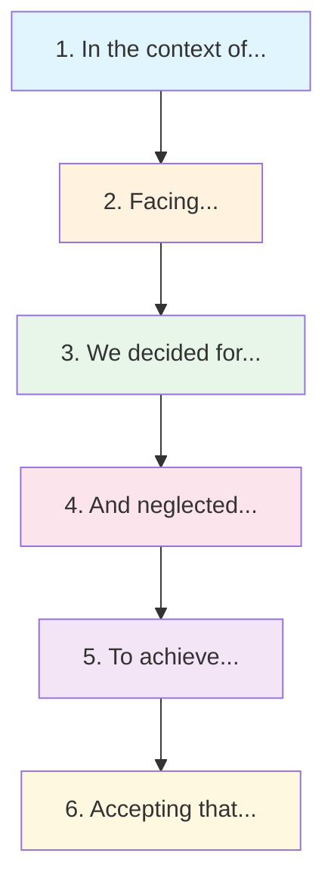

# SPEC-ADR-A: WH(Y) Statement Format

| Field | Value |
|-------|-------|
| **Specification ID** | SPEC-ADR-A |
| **Parent ADR** | [ADR-REF-001](ADR-FORMAT.md) |
| **Version** | 1.0 |
| **Status** | Draft |
| **Last Updated** | 2026-01-08 |

---

## Overview

This specification defines the WH(Y) statement format for architecture decision records. The format provides a structured, single-sentence decision statement that captures context, rationale, and trade-offs. It is designed to be project-agnostic and applicable to any software architecture process.

---

## WH(Y) Statement Structure

The WH(Y) statement is a structured sentence with six required elements:

```
In the context of <context>,
facing <facing>,
we decided for <decision>,
and neglected <neglected>,
to achieve <achieve>,
accepting that <accepting>.
```



---

## Element Definitions

### 1. "In the context of" (Context)

**Purpose:** Establishes the functional or architectural scope of the decision.

**Guidelines:**
- Reference the specific system, component, or capability area
- Be specific enough to distinguish from other decisions
- Include relevant constraints or environmental factors

**Examples:**
- "In the context of the project's task orchestration system"
- "In the context of migrating from monolith to microservices"
- "In the context of choosing a persistence layer for event sourcing"

---

### 2. "Facing" (Problem)

**Purpose:** Describes the specific problem, challenge, or need that triggers the decision.

**Guidelines:**
- State concrete problems, not abstract concerns
- Include evidence where possible (performance metrics, bug counts, user complaints)
- Multiple problems can be listed with commas

**Examples:**
- "facing race conditions in concurrent task execution, lack of visibility into task state, and no recovery mechanism for failed tasks"
- "facing 500ms average response times that exceed our 200ms SLA"
- "facing inconsistent data formats across three integration partners"

---

### 3. "We decided for" (Decision)

**Purpose:** States the chosen option clearly and unambiguously.

**Guidelines:**
- Name the specific approach, technology, or pattern
- Be precise enough that another team could identify the same solution
- Include key parameters or constraints of the decision

**Examples:**
- "we decided for an event-sourced state machine with persistent checkpointing"
- "we decided for PostgreSQL with JSONB columns for semi-structured data"
- "we decided for a BFF (Backend for Frontend) pattern with dedicated API gateways per client type"

---

### 4. "And neglected" (Alternatives)

**Purpose:** Lists rejected alternatives with brief reasons, establishing that other options were considered.

**Guidelines:**
- Include at least 2 alternatives
- Provide a parenthetical reason for each rejection
- Keep reasons concise -- details go in the Options Considered section

**Examples:**
- "and neglected simple mutex locking (insufficient for distributed scenarios), optimistic concurrency (too complex for our team size), and polling-based coordination (excessive resource consumption)"
- "and neglected MongoDB (operational complexity), DynamoDB (vendor lock-in), and flat files (no query capability)"

---

### 5. "To achieve" (Goals)

**Purpose:** States the desired outcomes and quality attributes the decision aims to deliver.

**Guidelines:**
- Use measurable outcomes where possible
- Reference specific quality attributes (performance, reliability, maintainability)
- Connect to business or project goals

**Examples:**
- "to achieve reliable task completion with at-most-once semantics, sub-second failover, and full audit trail for compliance"
- "to achieve query response times under 50ms at P99 with horizontal read scaling"
- "to achieve independent deployability per team with isolated failure domains"

---

### 6. "Accepting that" (Trade-offs)

**Purpose:** Explicitly acknowledges known downsides, risks, and costs of the decision.

**Guidelines:**
- Be honest about real costs and risks
- Include operational, learning, and maintenance overhead
- Note any conditions that would trigger re-evaluation

**Examples:**
- "accepting that event replay adds complexity to debugging, storage costs grow linearly with event volume, and the team needs training on event sourcing patterns"
- "accepting that JSONB queries are slower than normalized SQL for complex joins, and schema evolution requires application-level migration logic"

---

## Complete Example

```markdown
## WH(Y) Decision Statement

**In the context of** an e-commerce platform's order processing system,

**facing** lost orders during peak traffic (0.3% order loss rate during Black Friday),
database connection pool exhaustion under load, and inability to replay failed
transactions for recovery,

**we decided for** an event-sourced architecture using Apache Kafka for order events
with PostgreSQL as the read-model projection store,

**and neglected** traditional CRUD with retry logic (doesn't solve replay),
a pure message queue approach with RabbitMQ (lacks event history),
and a synchronous saga pattern (coupling and latency concerns),

**to achieve** zero order loss through persistent event log, horizontal scaling
during peak traffic (target: 10x current peak), complete transaction replay
capability for recovery and auditing, and eventual consistency with sub-second
read-model updates,

**accepting that** eventual consistency requires UI changes to handle "processing"
states, the team needs Kafka operational expertise (estimated 2-sprint ramp-up),
infrastructure costs increase approximately 40% for Kafka cluster, and
debugging distributed flows requires investment in distributed tracing tooling.
```

---

## Validation Rules

The following rules should be applied when reviewing WH(Y) statements:

| Rule | Description | Severity |
|------|-------------|----------|
| All 6 elements present | Every WH(Y) statement must include all six elements | Error |
| Context specificity | Context must reference a specific system area or capability | Warning |
| Problem evidence | Facing should include concrete evidence where available | Warning |
| Minimum alternatives | At least 2 alternatives must be listed in "neglected" | Error |
| Rejection reasons | Each neglected option must include a parenthetical reason | Error |
| Measurable goals | "To achieve" should include at least one measurable outcome | Warning |
| Honest trade-offs | "Accepting that" must acknowledge at least one real cost or risk | Error |

---

## Template File

The following is the complete ADR template that projects should use:

````markdown
# ADR-[ID]: [Title]

| Field | Value |
|-------|-------|
| **Decision ID** | ADR-[ID] |
| **Initiative** | [Initiative Name] |
| **Proposed By** | [Author/Team] |
| **Date** | [YYYY-MM-DD] |
| **Status** | Proposed |

---

## WH(Y) Decision Statement

**In the context of** [functional/architectural scope],

**facing** [specific problems, challenges, or needs],

**we decided for** [chosen option],

**and neglected** [alternative 1 (reason), alternative 2 (reason), ...],

**to achieve** [desired outcomes and quality attributes],

**accepting that** [known trade-offs, costs, and risks].

---

## Context

[Expanded description of the situation, background, and forces at play.
Include relevant history, constraints, and environmental factors.]

## Options Considered

### Option 1: [Name] (Selected)

[Description of the chosen option.]

**Pros:** [List advantages]
**Cons:** [List disadvantages]

### Option 2: [Name] (Rejected)

[Description of rejected option.]

**Why rejected:** [Reason for rejection]

### Option 3: [Name] (Rejected)

[Description of rejected option.]

**Why rejected:** [Reason for rejection]

---

## Specifications

| Spec ID | Title | Description |
|---------|-------|-------------|
| [SPEC-ID](path/to/spec.md) | [Title] | [Brief description] |

---

## Dependencies

| Relationship | ADR ID | Title | Notes |
|--------------|--------|-------|-------|
| [enables/requires/conflicts/supersedes/extends] | [ADR-XXX] | [Title] | [Notes] |

---

## References

| Reference ID | Title | Type | Location |
|--------------|-------|------|----------|
| [REF-XXX] | [Title] | [Background/External/Internal] | [Link] |

---

## Governance

| Review Board | Date | Outcome | Action | Review Cadence | Next Review |
|--------------|------|---------|--------|----------------|-------------|
| [Board] | [Date] | [Approved/Deferred/Rejected] | [Action items] | [Quarterly/Biannual/Annual] | [Date] |

---

## Status History

| Status | Approver | Date |
|--------|----------|------|
| Proposed | [Author/Team] | [YYYY-MM-DD] |
````

---

## Source Reference

This WH(Y) format is adapted from the Y-statement template by Olaf Zimmermann:

> **"In the context of** [use case or user story], **facing** [concern, i.e., a non-functional requirement], **we decided for** [option] **and neglected** [other options], **to achieve** [system quality], **accepting** [downside]."

- Zimmermann, O. (2020). "Sustainable Architectural Design Decisions." [https://www.ozimmer.ch/practices/2020/04/27/ArchitectureDecisionMaking.html](https://www.ozimmer.ch/practices/2020/04/27/ArchitectureDecisionMaking.html)

The enhanced version adds the sixth element ("accepting that") and provides more structured guidance for each element.
