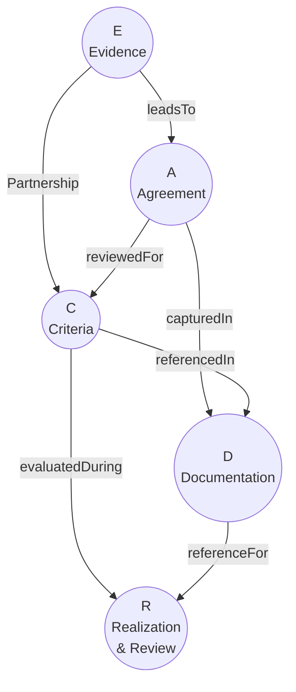
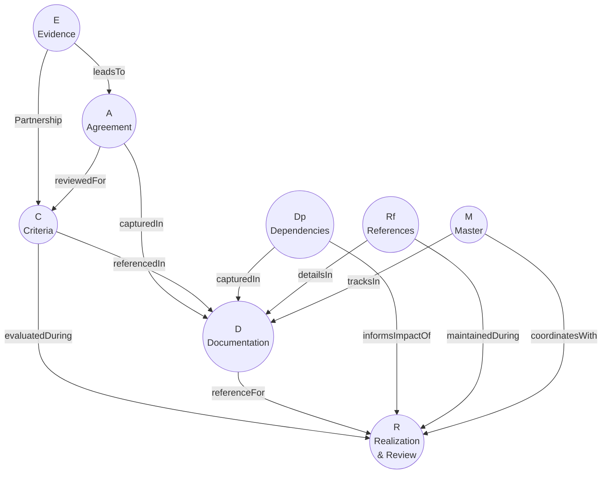

# SPEC-ADR-E: Extended Definition of Done

| Field | Value |
|-------|-------|
| **Specification ID** | SPEC-ADR-E |
| **Parent ADR** | [ADR-REF-001](ADR-FORMAT.md) |
| **Version** | 1.0 |
| **Status** | Draft |
| **Last Updated** | 2026-01-08 |

---

## Overview

This specification defines an extended "Definition of Done" checklist for architecture decisions. Based on Olaf Zimmermann's ECADR criteria, it adds checks for dependencies, references, and master ADR linkage.

---

## Core ECADR Criteria

The foundational Definition of Done consists of five criteria:



### E - Evidence

> **"Are we confident enough that this design will work?"**

| Check | Description |
|-------|-------------|
| Proof of concept | Has the approach been validated? |
| Prior art | Are there successful examples elsewhere? |
| Expert input | Have relevant experts been consulted? |
| Risk assessment | Have technical risks been identified? |

### C - Criteria

> **"Have we decided between at least two options, and compared them (semi-)systematically?"**

| Check | Description |
|-------|-------------|
| Multiple options | At least two alternatives considered |
| Comparison criteria | Clear evaluation dimensions defined |
| Systematic evaluation | Options compared against criteria |
| Trade-off analysis | Pros/cons documented for each option |

### A - Agreement

> **"Have we discussed among each other and with peers just enough and come to a common view?"**

| Check | Description |
|-------|-------------|
| Stakeholder involvement | Relevant parties consulted |
| Consensus or decision | Clear outcome (agreement or escalation) |
| Dissent captured | Any objections documented |
| Authority clear | Decision-maker identified |

### D - Documentation

> **"Have we captured the decision outcome and shared the decision record?"**

| Check | Description |
|-------|-------------|
| ADR created | Decision documented in standard format |
| Shared/published | ADR available to relevant audience |
| Searchable | ADR indexed and discoverable |
| WH(Y) statement | Core decision captured in structured format |

### R - Realization & Review

> **"Do we know when to realize, review and possibly revise this decision?"**

| Check | Description |
|-------|-------------|
| Implementation plan | Path to realize the decision exists |
| Review schedule | Review cadence defined |
| Triggers identified | Conditions that would prompt revision |
| Owner assigned | Responsible party for ongoing review |

---

## Extended Criteria (Enhanced Mode)

The enhanced ADR mode adds three additional criteria:



### Dp - Dependencies

> **"Have we identified and documented dependencies on other ADRs?"**

| Check | Description |
|-------|-------------|
| Prerequisites identified | ADRs this decision depends on |
| Impact awareness | ADRs that depend on this decision |
| Relationship types | DEPENDS_ON, SUPERSEDES, RELATES_TO, REFINES |
| Circular check | No circular dependencies introduced |

### Rf - References

> **"Have we separated detailed specifications into referenced artefacts?"**

| Check | Description |
|-------|-------------|
| Specs separated | Implementation details in separate files |
| Links valid | References resolve to existing documents |
| Types appropriate | Correct specification types used |
| Versions tracked | Specification versions documented |

### M - Master (if applicable)

> **"If this is part of a larger initiative, have we linked to the Master ADR?"**

| Check | Description |
|-------|-------------|
| Master identified | Parent MADR linked if applicable |
| Phase assigned | Decision placed in correct phase |
| Registry updated | Master ADR registry includes this decision |
| Scope alignment | Decision within master's scope boundary |

---

## Definition of Done Checklist

### Interactive Checklist Template

```markdown
## Definition of Done

### Core Criteria (ECADR)

- [ ] **E - Evidence**: We are confident this design will work
  - [ ] Approach validated (PoC, prior art, or expert input)
  - [ ] Technical risks identified and assessed

- [ ] **C - Criteria**: We compared options systematically
  - [ ] At least two alternatives considered
  - [ ] Evaluation criteria defined
  - [ ] Trade-offs documented

- [ ] **A - Agreement**: We have reached common understanding
  - [ ] Relevant stakeholders consulted
  - [ ] Decision-maker identified
  - [ ] Dissenting views captured (if any)

- [ ] **D - Documentation**: Decision is captured and shared
  - [ ] ADR created in WH(Y) format
  - [ ] Published to ADR repository
  - [ ] Searchable and discoverable

- [ ] **R - Realization & Review**: We know when to implement and review
  - [ ] Implementation path exists
  - [ ] Review cadence set
  - [ ] Decision owner assigned

### Extended Criteria (Enhanced Mode)

- [ ] **Dp - Dependencies**: Relationships documented
  - [ ] Prerequisites identified (DEPENDS_ON)
  - [ ] Related decisions linked (RELATES_TO)
  - [ ] Superseded decisions marked (SUPERSEDES)
  - [ ] No circular dependencies

- [ ] **Rf - References**: Specifications separated
  - [ ] Technical details in spec files
  - [ ] All references resolve
  - [ ] Specification versions noted

- [ ] **M - Master** (if applicable): Initiative linkage complete
  - [ ] Master ADR identified and linked
  - [ ] Phase/sequence assigned
  - [ ] Master registry updated
```

---

## Scoring Model (Optional)

For organizations wanting quantitative metrics:

| Criterion | Weight | Pass | Partial | Fail |
|-----------|--------|------|---------|------|
| Evidence | 20% | 20 | 10 | 0 |
| Criteria | 20% | 20 | 10 | 0 |
| Agreement | 15% | 15 | 7 | 0 |
| Documentation | 15% | 15 | 7 | 0 |
| Realization & Review | 10% | 10 | 5 | 0 |
| Dependencies | 10% | 10 | 5 | 0 |
| References | 5% | 5 | 2 | 0 |
| Master (if applicable) | 5% | 5 | 2 | 0 |

**Thresholds:**
- **Approved**: Score >= 80%
- **Conditional**: Score 60-79%
- **Needs Work**: Score < 60%

---

## Quick Reference Card

```
+------------------------------------------------------------------+
|           Architecture Decision - Definition of Done              |
+------------------------------------------------------------------+
|                                                                   |
|  CORE (ECADR)                                                    |
|  ------------                                                    |
|  E  Evidence         - Will this design work?                    |
|  C  Criteria         - Did we compare options?                   |
|  A  Agreement        - Do stakeholders agree?                    |
|  D  Documentation    - Is the decision captured?                 |
|  R  Review           - When do we revisit?                       |
|                                                                   |
|  EXTENDED                                                         |
|  --------                                                        |
|  Dp Dependencies     - What does this depend on?                 |
|  Rf References       - Are specs in separate files?              |
|  M  Master           - Is this part of an initiative?            |
|                                                                   |
|  If all check -> Ready for approval                              |
|                                                                   |
+------------------------------------------------------------------+
```

---

## Source Reference

Based on the Definition of Done for Architecture Decisions by Olaf Zimmermann:

- [A Definition of Done for Architectural Decision Making](https://www.ozimmer.ch/practices/2020/05/22/ADDefinitionOfDone.html)

Extended with additional criteria from Recording Architecture Decisions (Expanded).
